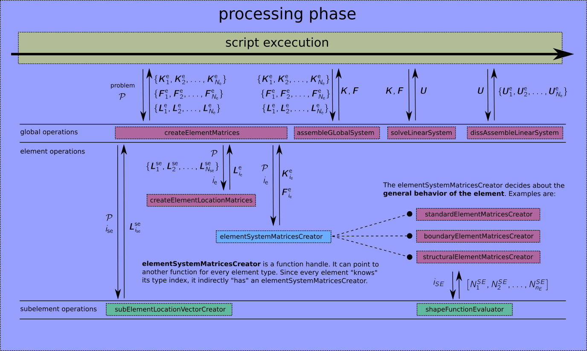

# Core #

In this subdirectory, the code for all basic features of *SiHoFemLab* is stored.

## Code structure ##
A typical anaylsis script usually follows three basics steps
1. definition of the problem data structure (pre-processing)
2. setting up and solving the system of equations (processing)
3. extracting and visualizing the results (post-processing)

### Preprocessing ###
In the preprocessing phase, the problem data structure is created. An explanation of all field of the structure that need to be provided can be found in [problemOperations/](problemOperations/)
Further, the [example directory](/examples/) contains a lot of scripts where you can copy paste from.

### Processing ###
The processing phase usually consists just a few lines of codes as given on the [top level documentation page](/README.md):
```matlab
%% create problem
problem.name = 'my Problem'
% define other fields of problem ...

%% perform analysis
[allKe, allFe, allLe] = goCreateElementMatrices( problem );
[ K, F ] = goAssembleSystem( allKe, allFe, allLe );
U = K \ F;
[ allUe ] = goDisassembleVector( U, allLe );
% post process the results ...
```

The figure below shades some light on what is actually going on under the hood, i.e. in the function **goCreateElementMatrices**.


The **elementSystemMatricesCreator** is a function handle or funtion pointer, that is defined for every element type. Every element knows its type, so looping through all elements and computing their system matrices looks like this:
```matlab
for iElement = 1:nElements
    % get element system matrices creator
    elementTypeIndex = problem.elementTypeIndices(iElement);
    systemMatricesCreator = problem.elementTypes{elementTypeIndex}.systemMatricesCreator;

    % create stiffness matrix and load vector
    [ allKe{iElement}, allFe{iElement} ] = systemMatricesCreator(problem, iElement);

    % create location vector
    [ allLe{iElement} ] = eoGetLocationVector(problem, iElement, allLse);    
end
```

You can find this code snippet as it is given here in the function **goCreateElementMatrices**. In [core/elementOperations/](elementOperations/) the **standardElementMatricesCreator** is explained in more detail.

### Postprocessing ###
With the cell array of all element solution vectors, you may calculate stresses inside a certain element, export a vtk-file or calculate global quantities like the strain energy.
You can find the corresponding function in [elementOperations/](elementOperations/) and [globalOperations/](globalOperations/).

## Files in SiHoFemLab/core/ ##

### README.md ###
This file. Every subdirectory should have a file like this, where a general overview of its content and a list with a short explanation for each file and each subdirectory is given.

## Subdirectories in SiHoFemLab/core/ ##

### problemOperations/ ###
Functions that provide help when setting up a problem data structure. This includes reading mesh files and creating element/subelement types.

### globalOperations/ ###
Functions usually called directly from the analyses scripts.

### elementOperations/ ###
Operations performed for an <b>element</b> (can be thought of a classical finite element having nodes, quadrature points, a mapping from local to global coordinates, ... ). An element aggregates its shape functions using <b>subelements</b> in SiHoFemLab to avoid complicated implementations of high-order elements. More on the element-subelement-concept can be found <a href="core/elementOperations">here</a>.


### subelementOperations/ ###
Operations performed for an <b>subelement</b>. Elements use subelements to separate their shape functions into nodal, internal and edges modes (2D) or nodal, internal, edge and face modes (3D). A subelement can be thought of an <b>ansatz support</b>.


### mathOperations/ ###
Low level functions, which are not provided by matlab natively, e.g. calculation of pseudo determinants or inverses of non-square matrices, evaluation of typical polynomials (Lagrange, Legendre, ...), ...

**These top level subdirectories obey a simple rule: If ordered as above, functions in a certain subdirectory NEVER call functions from any of the subdirectories listed previously to their own subdirectory.**
