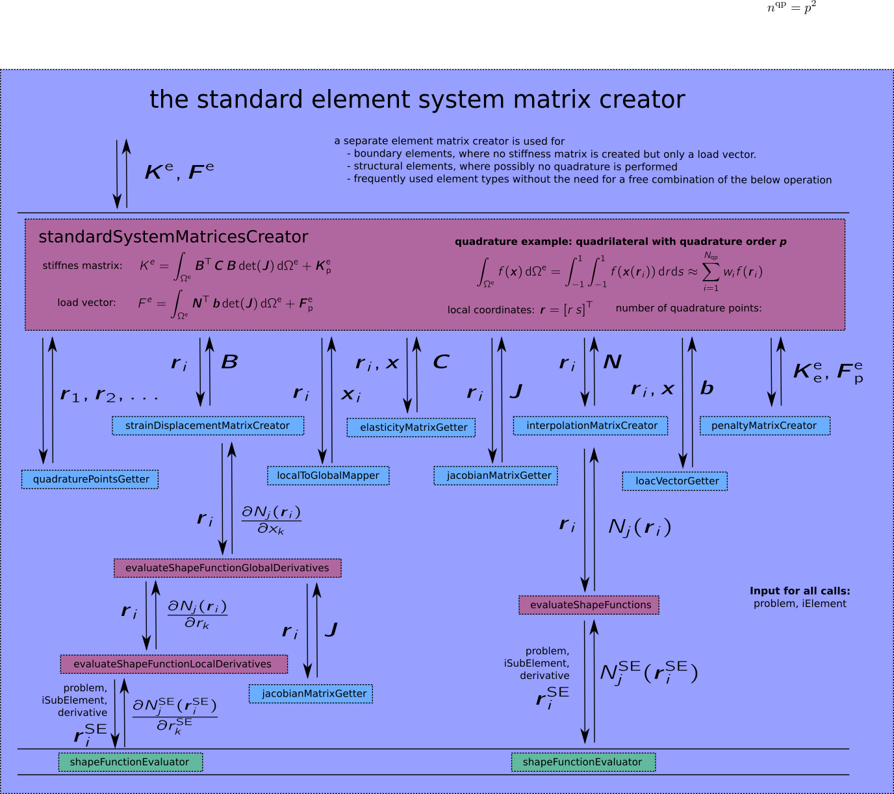

# Element Operations #
This subdirectory contains all functions that compute quantities on the element level. Most of them expect three arguments:

* the problem data structure
* the element index
* the local element coordinates, where the quantity should be evaluated

For different element types, different functions are used. Which function is used is defined by a corresponding function handle or function pointer in the element type data structure.
For the mos importand quantities, wrapper functions are provided, such that the function handle is hidden from the caller. An easy example is the function **eoEvaluateJacobian**. 
It looks like this:

```matlab
function jacobian = eoEvaluateJacobian(problem,elementIndex,localCoordinates)
% eoEvaluateJacobian Evaluates the Jacobian matrix for an element

  elementTypeIndex = problem.elementTypeIndices(elementIndex);
  jacobianEvaluator = problem.elementTypes{elementTypeIndex}.jacobianEvaluator;
  jacobian = jacobianEvaluator(problem,elementIndex,localCoordinates);

end
```

The most important function is the function **standardElementMatricesCreator**. 
It is called in the processing phase through a function handle of function pointer as explaind in [/core/](/core/).
The figure below depicts the steps performed by this function.
 


As can be seen, besides the **jacobianEvaluator**, there are other functions, which are choosen according to function handles given in the element type data structure.
For boundary element types, the the function **boundaryElementMatricesCreator** is called instead of **standardElementMatricesCreator**.
It looks just like the function standardElementMatricesCreator, however, just a load vector and no stiffness matric is computed.
For structural elements, for which a completely different procedure (possible no quadrature) may be followed to set up the element matrices, the function handle **elementSystemMatricesCreator** may point to yet another function.

##  Files in SiHoFemLab/core/elementOperations  ##

### context.txt ###
This file. 

### eoEvaluateJacobian.m ###
Function returning the Jacobian matrix

$`
\mathbf{J}
= \frac{\partial \mathbf{X}}{\partial \mathbf{r}} 
= \left[ \begin{array}{ccc}
\frac{\partial X_1}{\partial r_1} &  \frac{\partial X_1}{\partial r_2} & \frac{\partial X_1}{\partial r_3} \\
\frac{\partial X_2}{\partial r_1} &  \frac{\partial X_2}{\partial r_2} & \frac{\partial X_2}{\partial r_3} \\
\frac{\partial X_3}{\partial r_1} &  \frac{\partial X_3}{\partial r_2} & \frac{\partial X_3}{\partial r_3}
\end{array} \right]
\quad \text{or} \quad
J_{ij} = \frac{X_i}{r_j}.
`$

As usually, $`\mathbf{r}`$ denotes the element's local coordinates while $`\mathbf{X}`$ denotes the global coordinates.

### eoEvaluateMapping.m ###
Function returning the global position $`\mathbf{X} = \mathbf{Q}(\mathbf{r})`$.

### eoEvaluateInverseMapping.m ###
Function returning the local position $`\mathbf{r} = \mathbf{Q}^{-1}(\mathbf{X})`$.

### eoEvaluateShapeFunctionGlobalDerivatives.m ###
Function returning an array containing the global derivatives of the element's shape functions

$`
\left[ \frac{\partial N_1(\mathbf{r})}{\partial \mathbf{X}} ~ \frac{\partial N_2(\mathbf{r})}{\partial \mathbf{X}} ~ \ldots ~ \frac{\partial N_{n_\mathrm{shapes}}(\mathbf{r})}{\partial \mathbf{X}} \right].
`$

### eoEvaluateShapeFunctionLocalDerivatives.m ###
Function returning an array containing the local derivatives of the element's shape functions

$`
\left[ \frac{\partial N_1(\mathbf{r})}{\partial \mathbf{r}} ~ \frac{\partial N_2(\mathbf{r})}{\partial \mathbf{r}} ~ \ldots ~ \frac{\partial N_{n_\mathrm{shapes}}(\mathbf{r})}{\partial \mathbf{r}} \right].
`$

### eoEvaluateShapeFunctions.m ###
Function returning an array containing the element's shape functions 

$`
\left[ N_1(\mathbf{r}) ~ N_2(\mathbf{r}) ~ \ldots ~ N_{n_\mathrm{shapes}}(\mathbf{r}) \right].
`$

### eoEvaluateTotalLoad.m ###
Function returning the load vector denoted by $`\mathbf{b}`$ or $`\mathbf{t}`$ in the weak form depending on wether a volume element (body load) or a surface element (traction) is considered. In any case, the total load is simply the sum of all loads acting on the elements, i.e. 

$`
\mathbf{b} = \sum_i^{n_\mathrm{loads}} \mathbf{b}_i \quad \text{or} \quad \mathbf{t} = \sum_i^{n_\mathrm{loads}} \mathbf{t}_i.
`$


### eoGetLocationVector.m ###
Function returning the lement location vector

$`
\mathbf{l} =
\left[ i_1 ~ i_2 ~ \ldots ~ i_{n_\mathrm{dof}} \right]
`$

which contains the global indices $`i_j`$ for every local degree of freedom $`j`$.
That is, an element's location vector always has as many columns as there are degrees of freedom. The number of degrees of freedom for an element depends on the problem dimension and on the number of shape functions the element has:

$`
n_\mathrm{dof} = n_\mathrm{dimensions} \cdot n_\mathrm{shapes}
`$

### eoGetNodalShapeIndices.m ###
Function returning the indices of the nodal shape function within the vector of all shape functions of an element.

### eoGetPenaltySystemMatrices.m ###
Function returning the element's penalty system matrices $`\mathbf{K}^\mathrm{E}_\mathrm{P}`$ and $`\mathbf{F}^\mathrm{E}_\mathrm{P}`$.
For a standard quadrilateral element with nodal shape functions and a dirichlet boundary condition $`\mathbf{u}=\hat{\mathbf{u}}=\left[ \hat{u}_1 ~ \hat{u}_2 \right]^\mathrm{T}`$ prescribed for nodes 1 and 3 we would get

$`
\mathbf{K}^\mathrm{E}_\mathrm{P} = \left[ \begin{array}{cccccccc}
P & 0 & 0 & 0 & 0 & 0 & 0 & 0 \\
0 & P & 0 & 0 & 0 & 0 & 0 & 0 \\
0 & 0 & 0 & 0 & 0 & 0 & 0 & 0 \\
0 & 0 & 0 & 0 & 0 & 0 & 0 & 0 \\
0 & 0 & 0 & 0 & P & 0 & 0 & 0 \\
0 & 0 & 0 & 0 & 0 & P & 0 & 0 \\
0 & 0 & 0 & 0 & 0 & 0 & 0 & 0 \\
0 & 0 & 0 & 0 & 0 & 0 & 0 & 0
\end{array} \right]
\quad \text{and} \quad 
\mathbf{F}^\mathrm{E}_\mathrm{P} = \left[ \begin{array}{c}
P \, \hat{u}_1 \\
P \, \hat{u}_2 \\
0 \\
0 \\
P \, \hat{u}_1 \\
P \, \hat{u}_2 \\
0 \\
0
\end{array} \right]
`$

where $`P`$ is the penalty value.


##  Subdirectories in SiHoFemLab/core/  ##

### elasticityMatrixEvaluators/ ###

### elementPlotters/ ###

### jacobianEvaluators/ ###

### mappingEvaluators/ ###

### massDensityEvaluators/ ###

### postGridCellCreators/ ###

### quadraturePointGetters/ ###

### systemMatricesCreators/ ###

