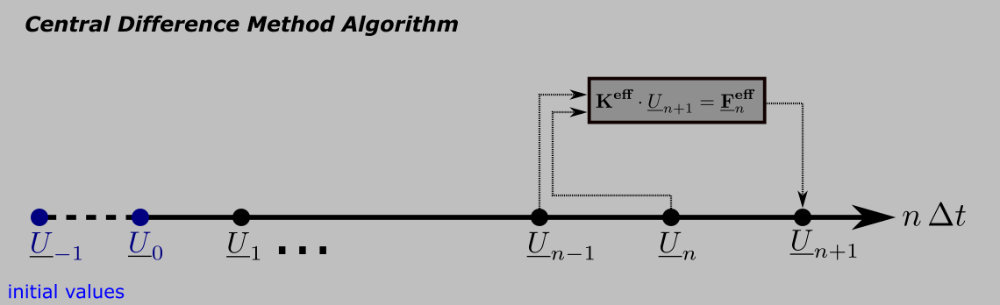

<h1>Central Difference Method</h1>

<h4> cdmDynamicSolver.m </h4>
This function computes the <b>displacements for every timestep</b>.

Algorithm of the Central Difference Method: Calculate the next timestep from the  <b>last two</b> timesteps (since we solve a <b>second order</b> DGL).
Assume $`\underline{U}_{-1} = \underline{U}_{0} = 0`$ (system is in equilibrium for $`t \leq 0`$).

